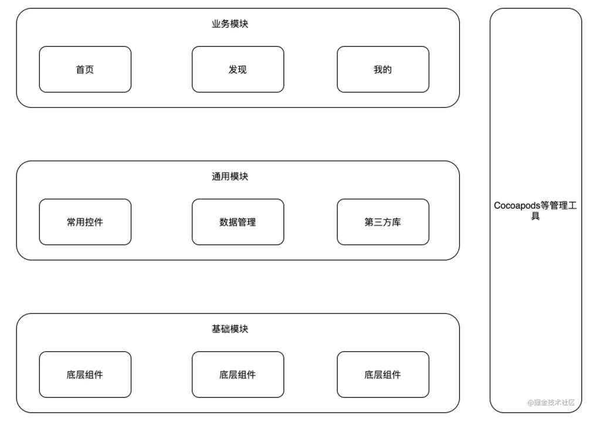
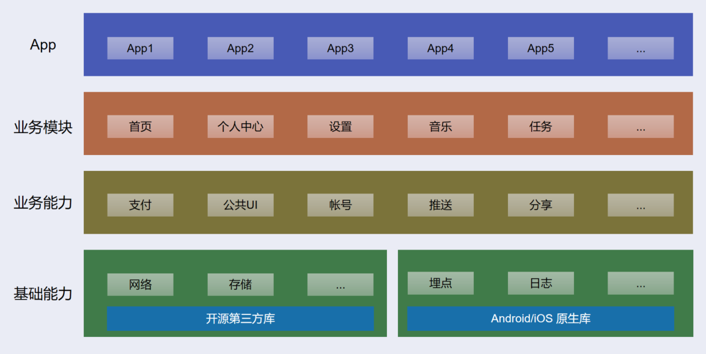
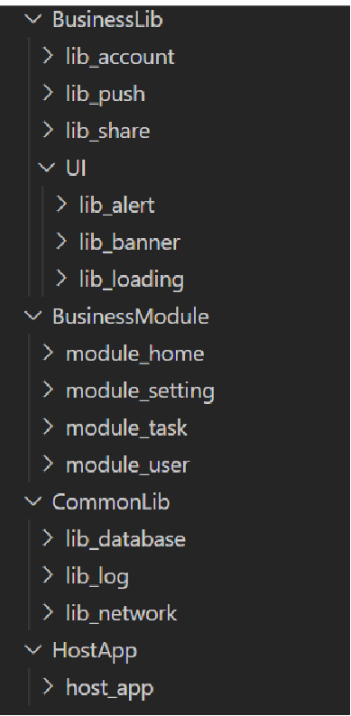

# 纯 `Flutter` 工程的分层架构设计以及工程化实践

> 一家之言，勿喷。若有更好方案，欢迎共享。

## 前言

关于 `Flutter` 的教程已经有很多了，也有很多优秀的开源项目，这在一定程度上也增加了社区的活跃度。同时也有很多商业项目在实践，不过多数是将`Flutter`工程作为一个`module`来嵌入原生工程。官方有对应的教程来指导相关的工程化，网上的教程也很多。

但是一个纯 `Flutter` 工程的分层架构设计以及工程化的教程并不是很多。恰巧最近有个项目需要基于 `Flutter` 工程来搭建，对分层设计以及相应的工程化做了一些思考和调研，此仓库的目的即在于记录方案，与大家分享。

## 分层设计

分层设计和目前成熟的移动端的分层设计差不多，都是根据基础能力和业务模块对 `App` 进行分层以及组件划分，从而达到组件化的目的。
例如下图是一个很常见的移动端分层设计。



将与业务无关的基础能力剥离出来，沉淀到最底层，上层的业务都会基于这些能力去构建；中间划出一个业务能力层，多数是一些弱业务逻辑的模块，像分享、支付这样的能力；然后是业务模块，这些基本上就是用户可感知的界面以及业务逻辑了；最后是宿主`App`。基于这样的分层设计，宿主`App`一般都是个壳工程。

针对这样的设计，相应的组件间通信方案、工程化方案都已经很成熟，而且可选方案也很多。这里不再赘述，感兴趣的可以自行`Google`。

所以我们的`Flutter`应该也是可以按照这样的分层去设计，但是由于`Flutter`开发中可能会遇到需要原生提供能力的场景，这样就会有一部分能力是基于原生能力封装的插件，但总的分层设计还是类似的。例如下图的分层设计：



## 工程化实践

目前网络上关于这一块的讨论比较少，如果你有看到相关的文章，欢迎共享。鉴于组内`iOS`的小伙伴是使用`VSCode`来开发的，所以工程化实践也是基于`VSCode`来操作的，不过这个应该影响不大。

### 模板工程介绍

我们先了解一下`Flutter`为我们提供的`4`中模板工程：`App、Module、Plugin、Package`。

1. `App`

我们一般都是创建一个`App`工程，这个模板工程会有`android`、`ios`目录，对应存放的是两个平台的工程。

2. `Module`

使用这个模板创建出来的工程，会有`.android`、`.ios`目录，从模板的名称可以猜到应该是作为`Module`来使用的，官方对于这个模板的应用场景是将`Flutter`作为原生的一个子`Module`。这个模板创建的时候也会有`main.dart`文件，可以单独运行在你的设备上。

3. `Plugin`

如果你需要封装基于原生能力的插件，就需要用到这个模板。

4. `Package`

这是一个纯`Flutter`模块，没有`android`、`ios`目录。

### `pubspec.yaml` 配置介绍

看过`Flutter`教程的应该都了解，如果我们需要引用一些第三方库，就可以在这里配置，一般我们配置的都是发布在 `pub.dev` 上的开源项目。但其实，除了可以直接依赖`pub.dev`，他还支持本地依赖，`git` 仓库依赖。你可以这样操作：

```
dependencies:
  plugin1:
    git:
      url: "git://github.com/flutter/plugin1.git"
  fish_redux:
    path: my_package/fish_redux-0.3.1
```

另外`git`依赖还支持指定`branch`，指定子目录等。

好了，铺垫了这么多，是时候介绍我们的工程化方案了。

### 具体方案

鉴于目前还处于初步实践阶段，所以并没有将各个组件上传到`git`仓库，而是采用基于本地依赖的方式。因为各个组件可能会频繁变动，就会不停的切换工程等。等后期稳定后，可以采用`git`依赖的方式，达到供多个`App`使用的目的。

先来看一下整个工程的目录结构，如果你有一定的分层设计经验，应该很容易理解这个目录结构的设计。



`HostApp` ：壳工程目录
`BusinessModule` ：业务模块目录
`BusinessLib`：业务能力目录，里面还有个二级的`UI`目录，存放一些和业务相关的公共`UI`组件
`CommonLib`	：基础能力目录
	
按照上面的思路，我们首先需要一个壳工程，我们使用`VSCode`新建一个`App`工程，这里放在`HostApp`目录下。

接着我们在`BusinessModule`中新建四个业务模块工程，这次我们不再新建`App`工程，而是新建`Module`工程。我这边新建了`module_home`、`module_user`、`module_task`、`module_setting`四个工程。

同样，我们在`BusinessLib`中也新建几个工程，供测试使用，这里新建了`lib_account`、`lib_push`、`lib_share`，然后在`UI`目录中新建了`lib_alert`、`lib_banner`、`lib_loading`。在`CommonLib`新建`lib_database`、`lib_log`、`lib_network`。其中`lib_account`、`lib_database`、`lib_network`是`Package`工程，`lib_push`、`lib_share`、`lib_alert`、`lib_banner`、`lib_loading`是`Module`工程，`lib_log`是`Plugin`工程。大家根据自己的实际场景去新建对应的模板工程。

这样所有的工程都放在对应的目录，为了方便管理，我们新建一个`workspace`来管理所有的工程。具体可以这样操作：

1. 在`VSCode`中`New Window`
2. `Add Folder to Workspace...`，选择我们的根目录
3. `Save Workspace As...`，保存到我们的根目录

下次可以直接打开我们的`workspace`文件。

现在打开`host_app`工程的`pubspec.yaml`做如下配置，将`BusinessModule`中的组件引入进来。

```
dependencies:
  module_home:
    path: ../../BusinessModule/module_home
  module_user:
    path: ../../BusinessModule/module_user
  module_setting:
    path: ../../BusinessModule/module_setting
  module_task:
    path: ../../BusinessModule/module_task
```

保存后运行`flutter pub get`。

> 这里有个小问题，就是使用`workspace`后，在`host_app`里面去引用`module_home`内定义的页面，没有代码提示，但是手动`import`后，编译都正常。不知道是`Bug`还是我使用的有问题。

我们在`module_home`、`module_user`、`module_setting`、`module_task`中各新建一个页面，`HomePage`、`UserPage`、`SettingPage`、`TaskPage`。

我们在`host_app`的入口构建一个`Tab`页面，将我们的`HomePage`、`UserPage`作为两个`Tab`加载进来。试着运行一下，感觉良好。

哇哦，基本的框架已经搭建出来了，虽然后续需要处理的事情还有很多，例如组件间的页面如何跳转、组件间如何通信，都需要有对应的方案实现。

且等我继续调研实践。